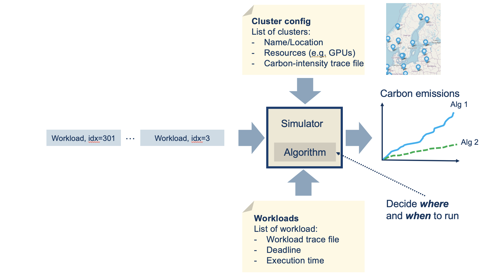

# Introduction
CarbonSim is a **discrete event simulator** designed to model **carbon emissions** in a **cloud-edge continuum**.



The simulator can **replay workloads** using data from the [MIT Supercloud dataset](https://arxiv.org/abs/2108.02037) and **carbon intensity information** obtained from [ElectricityMap](https://api.electricitymap.org/). It estimates the **carbon emissions released into the atmosphere** when running these workloads.

This enables the evaluation of **various scheduling and optimization algorithms**, such as **time-shifting**, to explore strategies for **reducing carbon emissions**.

[arch.png]

# Dataset Generation
Below are instructions how to generate a CarbonSim compatible dataset. 
If you prefer not to generate the dataset yourself, you can request a pre-generated version (~100 GB) by contacting **Johan Kristiansson** at [johan.kristiansson@ltu.se](mailto:johan.kristiansson@ltu.se).

The simulator requires four input components:

1. **Workloads**  
2. **Workload Replay Logs** – a predefined sequence indicating the order in which to replay the workloads  
3. **Carbon intensities**  
4. **List of cluster locations** – each associated with a different carbon intensity file  

## Workload Dataset and Replay Log
1. First download the MIT Supercloud dataset from here[https://dcc.mit.edu/data]. Note that the entire dataset is 2.4T.
```console
aws s3 cp s3://mit-supercloud-dataset/datacenter-challenge datacenter-challenge --recursive --no-sign-request
```
2. Then run the following scripts to generate a CarbonSim compatible dataset.
```console
python3 ./scripts/workflows/1_generate_workloads.py
python3 ./scripts/workflows/2_filter_workflows.py
python3 ./scripts/workflows/3_resample_workloads_cvs.py
python3 ./scripts/workflows/4_generate_workload_stat.py
python3 ./scripts/workflows/5_generate_max_waittime.py
python3 ./scripts/workflows/6_generate_summary.py
```

Note that the scripts contains hardcoded paths that needs to be changed, e.g.

```python
slurm_csv_file_path = '/scratch/datasets/datacenter-challenge/202201/slurm-log.csv'
app_csv_file_path = '/scratch/datasets/datacenter-challenge/202201/labelled_jobids.csv'
base_dir = '/scratch/datasets/datacenter-challenge/202201/gpu'
output_dir = './workloads'
```

Run this command to generate a replay log. 

```console
python3 ./scripts/workflows/7_generate_log.py --wait 80 --num_logs 100 --source_directory filtered_workloads_1s --target_directory ./80_logs
```

The scripts uses a **wait time parameter** `λ` (lambda) to sample delays between workload log entries.  The delay is sampled from an **exponential distribution**, commonly used to model inter-arrival times in event-driven systems.

The value of `λ` controls how frequently workloads are scheduled:

- A **higher λ** results in **shorter average wait times** between jobs.
- A **lower λ** leads to **longer intervals**, spreading out job execution.

You can configure this parameter in the workload generation or log replay scripts, depending on your simulation goals. The wait time parameter (lambda) to sample wait time between logs in an exponential distribution.

## Carbon Intensity Dataset
Use the script `scripts/carbon/1_fetch_co2_data.py` to fetch carbon intensity time series data from [ElectricityMap](https://api.electricitymap.org/).

The Git repository also includes carbon intensity traces for several months in 2024, located in the `./carbon` directory.

To make the dataset compatible with the simulator, it must be **resampled to a 1-second resolution**. Run the following commands to perform the resampling:

```console
python3 ./scripts/carbon/2_resample_carbon_cvs.py
python3 ./scripts/carbon/2_trim_carbon_1s_30d.py
```console

It will generate a CSV file with the following format:


Note that the scripts contains hardcoded paths that must be changed:

```python
input_dir = './carbon'
output_dir = './carbon_1s'
```

## Edge Cluster 
These scripts are utility scripts to help create edge cluster configurations.
```console
python3 ./scripts/edgeclusters/generate_edgecluster_cost.py
python3 ./scripts/edgeclusters/generate_european_zones.py
```

The simulator required an edge cluster configuration in JSON. Below is an example.
```json
[
    {
        "name": "Lulea",
        "nodes": 2,
        "gpus_per_node": 8,
        "carbon-intensity-trace": "./carbon_1s/SE-SE1.csv",
        "gpu_cost_euro_per_second": 0.001094
    },
    {
        "name": "Stockholm",
        "nodes": 2,
        "gpus_per_node": 8,
        "carbon-intensity-trace": "./carbon_1s/SE-SE3.csv",
        "gpu_cost_euro_per_second": 0.001101
    }
]
```

# Running a Simulation
To run a simulation, create a script similar to the examples provided in the `./simulator/experiments` directory.

The simulator produces several output trace files, which can be post-processed and visualized. See the `./notebook` directory for examples on how to visualize the generated data.

Example output files:

```console
./results/100_single/London.csv
./results/100_single/Lulea.csv
./results/100_single/Warsaw.csv
./results/100_single/scheduler.csv
```

The file `scheduler.csv` contains information about **energy consumption**, **carbon emissions**, **GPU utilization**, and **total GPU cost**.  

Below is a sample of its content:

| tick | cumulative_emission  | cumulative_energy  | utilization | total_gpu_cost |
|------|----------------------|--------------------|-------------|----------------|
| 0    | 0.000000             | 0.000000           | 0.000000    | 0.000000       |
| 1    | 0.000945             | 0.000008           | 0.000156    | 0.001094       |
| 2    | 0.001891             | 0.000016           | 0.000156    | 0.002188       |
| 3    | 0.002836             | 0.000024           | 0.000156    | 0.003282       |
| 4    | 0.003781             | 0.000032           | 0.000156    | 0.004376       |
| 5    | 0.004726             | 0.000040           | 0.000156    | 0.005470       |
| 6    | 0.005672             | 0.000048           | 0.000156    | 0.006564       |
| 7    | 0.006617             | 0.000057           | 0.000156    | 0.007658       |

The other CSV files contains utilisation info for each cluster.

**Note:**  
The `timepacking` variable is used to disable **time-shifting**, so that the scheduler considers **only spatial placement** in the presence of resource contentions.

```python
timepacking = True
```

## Example of Simulator script.
```python
import sys
sys.path.append('../../carbonsim/simulator')

from simulator import Simulator

max_processes = 10000
max_days = 2000 
workload_dir = "./filtered_workloads_1s"
workloads_stats_dir = "./filtered_workloads_1s_stats"
cluster_config = "./edge-clusters-single.json"
log_dir = "./logs/100"
log_file = "log_2.csv"

alg = "greedy"
results_dir = "./results/100_single/greedy"
power_threshold = 150 # watts
process_maxwait = 60 * 2 # seconds
co2_intensity_threshold = 160

def main():
    simulator = Simulator(alg,
                          power_threshold,
                          process_maxwait,
                          co2_intensity_threshold,
                          max_processes,
                          max_days,
                          log_dir,
                          log_file,
                          workload_dir, 
                          workloads_stats_dir,
                          cluster_config, 
                          results_dir)
    simulator.start()

if __name__ == "__main__":
    main()
```
